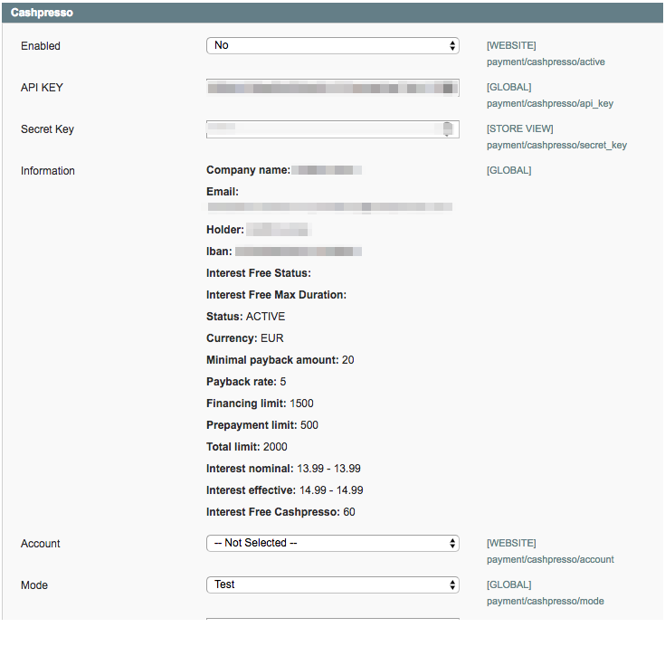

# CASHPRESSO 
 [Follow the link for more details about cashpresso.](https://www.cashpresso.com/)
 
### Table of Contents
**[Installation Instructions](#installation-instructions)**<br>
**[Configuration](#configuration)**<br>
**[How it works](#howto)**<br>
**[For developers](#developers)**<br>
**[Links](#links)**<br>

## Installation Instructions
### Composer installation
run composer command in the folder where the composer.json file is

	composer require limesoda/cashpresso:dev-master
	
or specific version:

    composer require limesoda/cashpresso:v1.0.1
	
and then to run 

    composer update
	   
### Manual installation using modman

copy sources code form the gz archive to .modman folder.
An example:

```
.modman/cashpresso/src/*
.modman/cashpresso/composer.json
.modman/cashpresso/modman
```

then type 

```modman deploy cashpresso```

### Magento Connect Manager

Menu: ```Magento Admin Menu / System / Magento Connect``` 

Find section "**Direct package file upload**" and upload **gz** archive. Then press upload.

### Magento Classic installation

1. Copy everything from ```src/app``` to ```app``` folder in you project.
2. ```src/skin/frontend/base/default/cashpresso/images``` to ```skin/frontend/base/default/cashpresso/images folder in your project```
3. Run your magento cron file. Module has an cronob which is run every half hour. It updates the information about your Cashpresso account to ```cashpresso/partnerinfo``` config which is accessible in DB only.

## Configuration

1. Logout your current admin session and then login again.
2. All settings are here: 
    
    ```Magento Admin Menu / System / Configuration / Payment Methods / Cashpresso```
    
   By default its not activated. You need to get API key and Secret Ket which you can find in Cashpresso account.
   Fill the fields API KEY and Secret Key up in the magento setting and save your settings. (You can fill other settings also but do not activate payment method until you not save you API Key and Secret Key).
   Now you should get information about your settings in Cashpresso account:
   
   
   
   An option ```Target account``` will be accessible now if you have target accounts on the Cashpresso side. 
    
3. Options table 
  
   Option | Description | Dependency
   ------ | ----------- | ---
   Account | Only needed if you want us to pay to different bank accounts on a per purchase basis. If not specified the purchase is paid to the main bank account of this partner. Please contact your contact your account manager for more information on using multiple target bank accounts. Notice: You cannot create or remove account in this module. |
   Mode | You can test your payment method using test mode. Its recommended to use test mode at the beginning. |
   Title | A title for mayment method on checkout page |
   Payment from Applicable Countries | You can set the filter for payment method availability by country. |
   Payment from Specific Countries | |
   Instructions | Mayment method description on the checkout page |
   Widget status | Switch it to YES if you want to show information about cashpresso price on product page or category |
   Widget integration | Cashpresso js label integration or you custom text for the price. Product level integration is recommended. Static Label Version has several disadvantages: <br> - No returning cashpresso customer detection <br> - No indication for successful risk check <br> - Server side calculation of instalment pricing necessary. | Widget integration
   Show checkout button | Show checkout button on the cashpresso popup when Widget integration has ```Show checkout button``` value. | Show checkout button, Widget status
   Place to show | The place where to show cashpress price information | Place to show, Widget status  
   Template | Template for the cashpresso price if Widget integration has status ```Static Label Integration```| Widget status, Widget integration
   The timeout for the order | Time in hours to wait for the customer approvment after successful order. |
   Sign contract text | A text on success page for the following order approvment |
   Description | We will displayed on the signup and payment process. |
   Write log | Writes api requests to log file. |
   Sort Order | An order of payment method in the list | 

4. Show checkout button option.

If you want to use this option check magento redirect option before:

    Magento Admin Menu / System / Checkout / Cart / Redirect to cart
 
If its set as "yes" then the button redirects to cart page only. Otherwise to checkout page.

## How it works

- customer can calculate automatically his debt on a product page. 
- customer adds one or more products to the cart 
- customer opens checkout to complete an order.
- on the payment step he can choose "cashpresso" payment method an recalculate his debt for the order.
- after successful purchase customer gets successful page where the cashpresso widget is triggered and asks customer to call to cashpresso to approve his debt.
- after the customer calling cashpresso sent to your store the status of the order. It could be sucess or cancel/timeout. If its cancel/timout then the order will be canceled automatically. Success status will assign status "in process" to order.
  

## For developers
### Blocks which are used for transport html definition

 - Mage_Checkout_Block_Onepage_Success
 - Mage_Catalog_Block_Product_Price

### Adding cashpresso price information on catalog and product pages
By default the price can be shown only for the simple products. But you can you an observer if you want to add the same functionality for the configurable products and for the other types.

    cashpresso_type_handler
    
An example (you can find it here as well: ```app/code/community/Limesoda/Cashpresso/Model/Observer/Sample.php```):

In your config.xml file:

    <cashpresso_type_handler>
        <observers>
            <your_module_cashpresso_types>
                <type>singleton</type>
                <class>your_module/observer_sample</class>
                <method>addType</method>
            </your_module_cashpresso_types>
        </observers>
    </cashpresso_type_handler>
    
Some your observer class:
    
    class Your_Module_Model_Observer_Sample
    {
        public function addType(Varien_Event_Observer $observer)
        {
            $result = $observer->getEvent()->getResult();
            $product = $observer->getEvent()->getProduct();
    
            array_push($result->types, 'configurable');
            
            // ...
        }
    }

### If you want to change the place of the price on the product page 
By default its placed right after the standard price. 
If you want to change the place you need to change the parameter "Place to show" to "In catalog/search".

After that add to your layout file this section.

      <catalog_product_view>
            <reference name="product.info.extrahint">
                <block type="ls_cashpresso/button" ifconfig="payment/cashpresso/active"
                       name="product.info.extrahint.cashpresso_button" translate="label"/>
            </reference>
       </catalog_product_view>  

You can change reference "product.info.extrahint" to any name.

### If you have checkout handler not like ```checkout_onepage_index```

Add to your checkout index handler this layout:

    <reference name="footer">
        <block type="ls_cashpresso/checkout" ifconfig="payment/cashpresso/active" name="footer.cashpresso.script" translate="label"/>
    </reference> 
    
### Redirect definition

You can manage redirection in this template:

    app/design/frontend/base/default/template/limesoda/cashpreso/page/js/head.phtml
   
You can define you redirect url using observer 
    
    cashpresso_js_c2checkout_url
   
An example:

In your config.xml file:
     
     <cashpresso_js_c2checkout_url>
         <observers>
             <your_module_cashpresso_types>
                 <type>singleton</type>
                 <class>your_module/observer_sample</class>
                 <method>setUrl</method>
             </your_module_cashpresso_types>
         </observers>
     </cashpresso_js_c2checkout_url>
         
Some your observer class:
     
     class Your_Module_Model_Observer_Sample
     {
         public function setUrl(Varien_Event_Observer $observer)
         {
             $urlObject = $observer->getEvent()->getUrl();
             $urlObject->url = "your url";
         }
     }

### API testing

You can activate Simulation Mode in cashpresso account to test magento API side.

On magento side it works only in test-mode.

1. Create an order using frontend side.
2. Open the page: ```http://yourwebsite.com/cashpresso/api/index```
   You will see an url. Something like this: ```http://yourwebsite.com/cashpresso/api/test/type/success/purchaseID/SIM-....b60a/```
3. Copy previous link and replace ```SIM-....b60a``` by your purchaseID. You can find it in DB: sales_flat_order_payment: additional_data field.
   Type parameter could have one of three statuses:  
   
    - success, if you want to test success cashoresso response
    - canceled, if you want to test cancellation from cashpresso side
    - timeout, if you want to test timeout response from cashpresso side.
  
## Links
 - [CashPresso API](https://test.cashpresso.com/urlreferral/api/ecommerce/v2?1)
 - [CashPresso](https://www.cashpresso.com/)
 - [Developer contacts](https://www.limesoda.com/kontakt/)